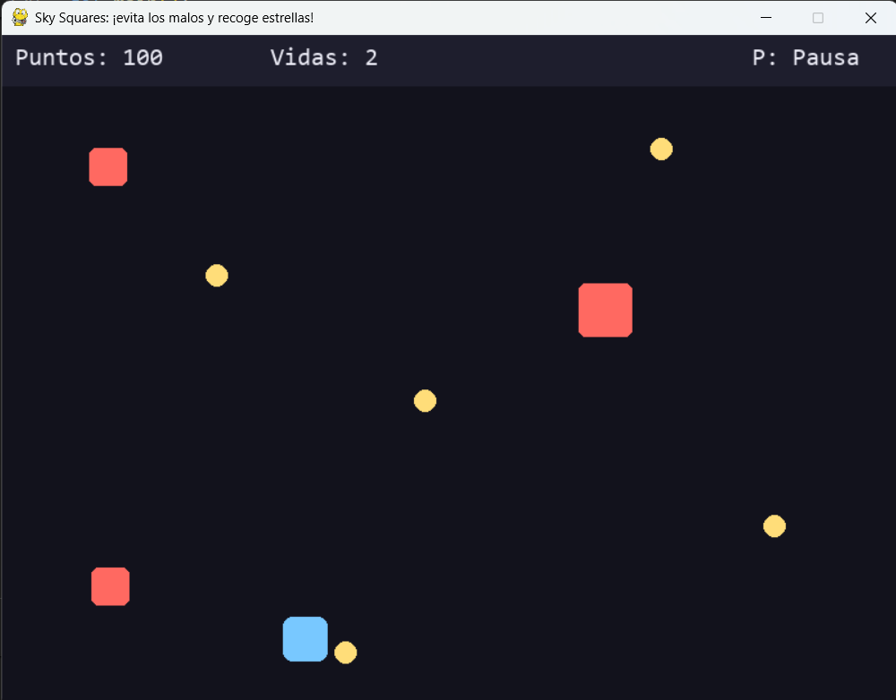
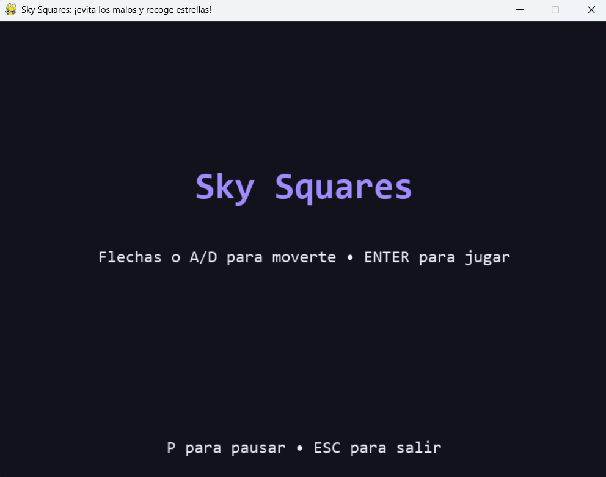

# 🌌 Sky Squares (PyGame)

**Sky Squares** es un minijuego arcade desarrollado en **Python** utilizando la librería **PyGame**.  

El jugador controla un pequeño cuadrado azul que debe **moverse lateralmente para esquivar enemigos** (cuadrados rojos) mientras **recoge monedas** (amarillas) para ganar puntos.  



A medida que el tiempo avanza, los enemigos aumentan su velocidad, lo que introduce una **dificultad progresiva** que pone a prueba tus reflejos.  

El juego incluye un **menú principal**, **pausa**, y **pantalla de Game Over**, con una estructura de estados bien definida.



Ideal para demostrar conceptos básicos de **programación de videojuegos 2D**, manejo de **eventos**, **colisiones**, **listas dinámicas**, y control del flujo de ejecución mediante **bucles y condicionales**.

---

## 🧰 Requisitos
- **Python 3.9 o superior**  
- **PyGame** 2.5+  
- Resolución de pantalla mínima: **800×600 px**  
- Sistema operativo: Windows, macOS o Linux  
- (Opcional) Soporte de teclado para flechas o teclas `A` y `D`

### 🔧 Instalación
Instala la librería PyGame ejecutando:
```bash
python -m pip install pygame
```
---

## 🎮 Controles

- **Mover:** ← → o A / D

- **Pausa:** P

- **Confirmar / Continuar:** ENTER

- **Menú / Salir:** ESC
  
---

## ⚙️ Mecánicas

- Los enemigos (rojos) caen y aceleran con el tiempo.

- Las monedas (amarillas) suman 10 puntos.

- Tienes 3 vidas para sobrevivir.
  
---
  
## 🧩 Estructura del código

- **Archivo principal:** game.py

- **Estados:** MENU, PLAYING, PAUSED, GAMEOVER

- **Entidades:** Player, Enemy, Coin (usando @dataclass)

- **Funciones clave:**
draw_text, spawn_enemy, spawn_coin, reset_game,
draw_menu, draw_pause, draw_gameover

- **Bucle principal:** gestión de entradas, spawns, colisiones y HUD
  
---

## 🎨 Paleta de colores (una sola y consistente)

- Fondo: `#12121C`  
- Panel HUD: `#1E1E2D`  
- Jugador: `#78C8FF`  
- Enemigo: `#FF6961`  
- Moneda: `#FFDD79`  
- Texto: `#EBEBF5`  
- Acento: `#A08CFF`  

Ya está aplicada en `COLORS` dentro del código.

---

## 👨‍💻 Autor
Desarrollado por **Juan Esteban Páez Fonseca**  
Universidad Santo Tomás - Ingeniería de Telecomunicaciones  
Bucaramanga, Colombia
